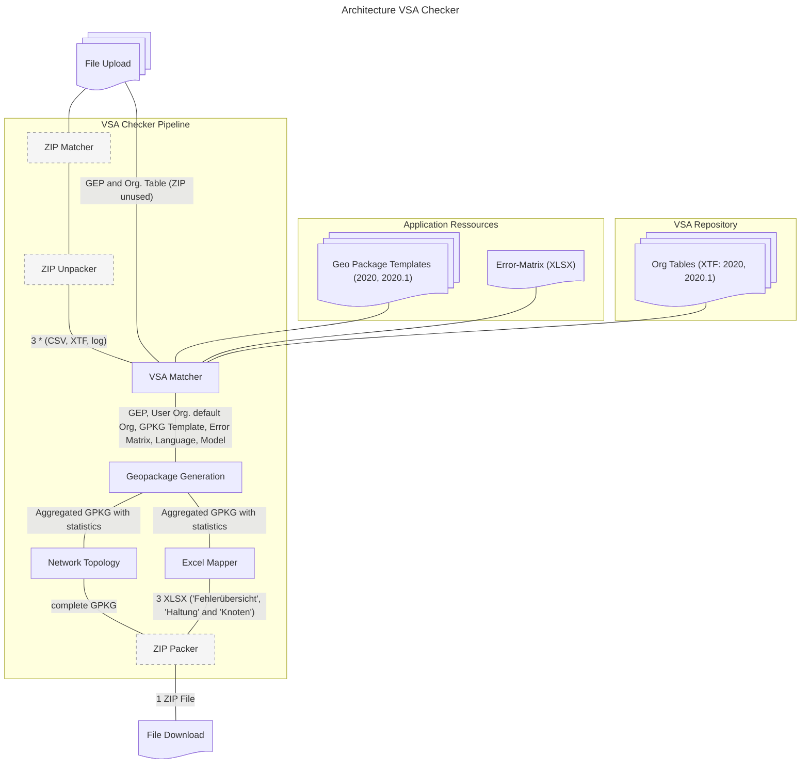

# Architektur VSA Checker

## Zweck

Der VSA Checker aggregiert Geodaten aus dem Bereich Siedlungsentwässerung in den Datenmodellen VSA-DSS Mini 2020 und VSA-DSS Mini 2020.1 gemeinsam mit ihren Prüflogs aus dem GEP-Checker des VSA (CHECKVSA).

Der **GEP-Checker (CHECKVSA)** ist ein eigenständiges, vorgelagertes VSA-Tool, das vom Benutzer separat ausgeführt wird und ein ZIP mit Prüflogs (CSV / XTF / Log je Prüfklasse) erzeugt. Dieses ZIP bildet zusammen mit dem GEP selbst den Input für den VSA Checker — CHECKVSA selbst ist nicht Teil dieser Architektur.

Die Pipeline nimmt die hochgeladenen Dateien des Benutzers entgegen, konvertiert sie in ein GeoPackage und reichert dieses mit mitgelieferten Vorlagen und Referenztabellen an. Output ist ein ZIP-Paket mit aggregiertem GeoPackage, Statistik-Tabellen gemäss einer definierten Excel-Vorlage und eine QGIS-Projektdatei zur Visualisierung des GeoPackages.

## Übersicht

> Gestrichelte Knoten (`ZIP Matcher`, `ZIP Unpacker`, `ZIP Packer`) sind Built-In-Prozessoren von geopilot und werden im VSA-Plugin nur konfiguriert, nicht implementiert.

## Application Resources

Statische Ressourcen, die mit der Anwendung ausgeliefert werden und im
gemounteten Docker-Verzeichnis abgelegt sind. Sie werden zur Laufzeit
schreibgeschützt eingelesen.

- **Geo Package Templates (2020, 2020.1)** — Vorlagen-GeoPackages, die als
  Schema-Grundlage für das aggregierte Ausgabe-GPKG dienen. Die Versionsnummern
  entsprechen den VSA-Datenmodellversionen. Die verwendete Version wird anhand der Version der hochgeladenen GEP-Transferdatei (DSS Mini-XTF) bestimmt.
- **Error-Matrix (XLSX)** — Excel-Tabelle mit der Definition möglicher
  Validierungsfehler und deren Schweregrad / Kategorisierung. Anhand der Error-Matrix können die Ergebnisse des GEP-Datencheckers (CHECKVSA) interpretiert und damit das Validierungsergebnis mit zusätzlichen Informationen angereichert werden. Die Error-Matrix dient als zentrale Referenz für die Fehlerklassifikation und ermöglicht eine konsistente Bewertung der Prüfergebnisse.
- **QGIS Project File (QGZ)** — Vorbereitetes QGIS-Projekt, das dem Endbenutzer
  ein direkt öffenbares Visualisierungs-Setup für die Ausgabedaten liefert.

## VSA Repository

Öffentliches Repository, das vom VSA unter <https://www.vsa.ch/models/?dir=organisation> gepflegt wird. Bei jedem Pipeline-Run werden die benötigten Ressourcen frisch von dort geladen — sie sind also **nicht** Teil des Container-Images, sondern werden zur Laufzeit aktuell gehalten. Damit profitiert die Pipeline automatisch von Aktualisierungen der vom VSA bereitgestellten Stammdaten, ohne dass das VSA-Plugin neu deployed werden muss.

- **Org Tables (XTF: 2020, 2020.1)** — Standard-Organisationstabellen im INTERLIS-Transferformat (XTF), eine pro Datenmodellversion. Die verwendete Version wird anhand der Version der hochgeladenen GEP-Transferdatei bestimmt. Die Organisationstabellen enthalten Informationen über die am Projekt beteiligten Organisationen (z.B. Gemeinden, Ingenieurbüros) und werden für die Validierung und Anreicherung der Daten verwendet.

## Pipeline-Prozessoren

Die Pipeline ist sequenziell und basiert auf den Abstraktionen aus
`GeoWerkstatt.Geopilot.PipelineCore`. Jeder Prozessor erhält definierte
Eingabe-Daten und produziert wohldefinierte Ausgaben für den nächsten
Schritt.

### ZIP Matcher

> Generischer geopilot-Built-In zur Selektion von Dateien aus dem Upload nach Dateityp. Wird im VSA-Plugin nur konfiguriert, nicht implementiert.

Erkennt alle hochgeladenen ZIP-Dateien und stellt sie dem [ZIP Unpacker](#zip-unpacker) zur Verfügung.

Der ZIP Matcher enthält eine Post-Condition, welche sicherstellt, dass genau eine ZIP-Datei gefunden wurde. Wenn keine oder mehrere ZIP-Dateien gefunden werden, wird die Pipeline mit einem Fehler abgebrochen.

### ZIP Unpacker

> Generischer geopilot-Built-In zum Entpacken von ZIPs. Wird im VSA-Plugin nur konfiguriert, nicht implementiert.

Entpackt das vom Benutzer hochgeladene GEP-Checker-Resultat (ZIP) und stellt die enthaltenen Dateien — typischerweise drei Tripel aus CSV, XTF und Log-Datei — für den VSA Matcher bereit. Somit werden 9 Files aus dem ZIP extrahiert: die drei VSA-Prüfklassen `a` (ARA-Einzugsgebiet), `FP` (Fachprüfungen) und `T` (Trägerschaft), jeweils als CSV, XTF und Log. Der Inhalt der verschiedenen Dateitypen ist der selbe aber in unterschiedlichen Formaten (CSV als tabellarische Darstellung, XTF als INTERLIS-Transferformat, Log als Rohtext mit Fehlermeldungen). Die weitere Verarbeitung erfolgt einfachheitshalber mit den CSV-Dateien, da sich diese am besten für die weitere Verarbeitung eignen.

### VSA Matcher

> Detaillierte technische Dokumentation (Konfiguration, Ein-/Ausgaben, ILI-Modellnamen, Validierung): [vsa-matcher.md](vsa-matcher.md)

Prozessor, welcher die Eingabedaten aus User-Upload und GEP-Checker-Output gemäss ihrer Semantik aufteilt, mit den passenden Application Resources anreichert und auf benannten Kanälen an die nachfolgenden Prozessoren weitergibt.

**Inputs**:

- **User-Upload**: DSS Mini-Transferdatei (anhand des INTERLIS-Modellnamens werden Modellversion 2020 / 2020.1 und Sprache DE / FR bestimmt — beides steuert die Auswahl der Resources), optional eine Organisationstabelle.
- **GEP-Checker-Output**: 9 Dateien aus dem Unzipper (`a` / `FP` / `T` × CSV / XTF / Log) — der Matcher verwendet nur die CSV-Dateien für die Weiterverarbeitung.
- **Application Resources**: anhand der Modellversion aus dem GEP wird automatisch das passende Vorlage-GPKG gewählt; die Error-Matrix ist versionsunabhängig.
- **VSA Repository**: anhand der Modellversion wird die passende Standard-Org-Tabelle bei jedem Run frisch vom öffentlichen VSA-Repository geladen.

**Ausgabekanäle** (was an `Geopackage Generation` weitergegeben wird):

- DSS Mini-Transferdatei (durchgereicht)
- Modellversion: `2020` oder `2020.1` (extrahiert aus GEP)
- Sprache: `DE` oder `FR` (abgeleitet aus dem INTERLIS-Modellnamen des GEP)
- Optionale Organisationstabelle (durchgereicht, falls vorhanden)
- GEP-Checker-CSVs
  - `T`: "Prüfungsart: Trägerschaft"
  - `A`: "Prüfungsart: "ARA-Einzugsgebiet"
  - `FP`: "Prüfungsart: "Fachprüfungen"
- Vorlage-GPKG (passend zur Modellversion)
- Standard-Org-Tabelle (passend zur Modellversion, aus VSA Repository)
- Error-Matrix

Der VSA-Matcher enthält eine Liste von Post-Conditions, welche prüfen ob alle notwendigen Daten für die nachfolgenden Schritte vorhanden sind. Wenn eine Post-Condition fehlschlägt, wird der gesamte Prozess mit einem Fehler abgebrochen.

- Exakt eine DSS Mini-Transferdatei muss vorhanden sein
- Exakt eine Modellversion muss definiert sein (2020 oder 2020.1)
- Exakt eine Sprache muss definiert sein (DE oder FR)
- Entweder keine oder genau eine Organisationstabelle (optional)
- Drei Error Datensätze aus dem GEP-Checker-Output müssen vorhanden sein (CSV: a, FP und T)
- Ein Geopackage Template muss vorhanden sein
- Eine Standard-Organisationstabelle muss vorhanden sein
- Eine Error-Matrix muss vorhanden sein

### Geopackage Generation (Aggregation)

> Detaillierte technische Dokumentation (Konfiguration, Ein-/Ausgaben, etc.): [vsa-geopackage-generation.md](vsa-geopackage-generation.md)

Erzeugt aus dem Output des VSA Matcher ein aggregiertes GeoPackage. Dieses GPKG ist Eingabe für zwei nachgelagerte Prozessoren ([Network Topology](#network-topology) und [Excel Mapper](#excel-mapper)) — beide arbeiten auf dem gleichen aggregierten Stand, weil die Excel-Reports keine berechnete Netztopologie benötigen.

Die Aggregation umfasst drei Hauptschritte:

**1. Interlis-Import** — XTF-Dateien werden mit `ili2gpkg` (Tool aus dem INTERLIS-Stack zur Konvertierung XTF → GeoPackage) ins GPKG importiert:

1. Standard-Organisationstabelle importieren
2. Optional (wenn vorhanden) Organisationstabelle aus Upload importieren
3. GEP importieren

**2. Fehleraufbereitung**:

1. Import der Fehler aus dem GEP-Checker-Output (CSV)
2. Error-Matrix-Import (XLSX)
3. Verknüpfung der Fehler aus dem GEP-Checker mit den Definitionen in der Error-Matrix.

**3. Statistiken** — diverse Joins und Aggregationen mit den Geodaten:

1. Fehler kategorisieren und objektweise aggregieren (z.B. Anzahl Fehler je Leitung)
2. Geometrien der betroffenen Objekte mit Fehlern joinen und in eigener Tabelle ablegen (jeder Fehler ist so einzeln darstellbar im GIS)
3. Fehlerstatistik über alle Klassen in eigener Tabelle erstellen

### Network Topology

Komplettiert falls notwendig die Netztopologie und gibt dieses vervollständigte Geopackage als Output weiter. Die Topologie wird anhand der bestehenden Geometrien und der Referenzen in den Daten berechnet. Dabei werden folgende Schritte durchgeführt:

1. Mit Leitungen nicht topologisch verbundene, aber von ihnen referenzierende Netzknoten identifizieren (Start- bzw. Endpunkt Leitung nicht lagegleich mit referenziertem "von-" bzw. "nach-Knoten" mit geringer Toleranz).
2. Ueberlauf_Foerderaggregat: Für jedes Objekt in dieser Tabelle eine Linie zwischen dem "Von-" und dem "nach-"-Knoten erstellen.
3. Bestehende Linien um zusätzlichen Start- bzw. End Node erweitern, der lagegleich mit dem referenzierten Knoten ist
4. Alle Netzkanten inklusive topologisch bereinigten Objekten in neuem Linienlayer speichern
5. Nur topologisch bereinigte Abschnitte als eigene Objekte (Delta zu originalem Layer "leitung") als "Topologielinien" in eigenem Linienlayer ablegen.

### Excel Mapper

Erzeugt aus dem aggregierten GPKG drei XLSX-Tabellen:

- **Fehlerübersicht** - Tabellarische Darstellung der aggregierten Fehler und ihrer Bezugsobjekte mit einer Übersichtsstatistik
- **Haltung** - Tabellarische Darstellung der Haltungen (Rohrleitungen) und aller Fehler, die mit ihnen assoziiert sind mit einer Übersichtsstatistik.
- **Knoten** - Tabellarische Darstellung der Knoten (Schächte, Sonderbauwerke) und aller Fehler, die mit ihnen assoziiert sind mit einer Übersichtsstatistik.

#### Error Overview Export (Fehlerübersicht)

> Detaillierte technische Dokumentation (Konfiguration, Ein-/Ausgaben, Mapping-Validierung): [error-overview-export.md](error-overview-export.md)

Liest `ca_error_data` und `ca_error_object` aus dem aggregierten GeoPackage und exportiert sie in eine Excel-Arbeitsmappe mit zwei Sheets. Sheet-Namen, Spalten-Positionen (Excel-Buchstaben) und Header-Bezeichnungen sind vollständig über die Pipeline-YAML konfigurierbar. Die `attributeMapping` und `columnMapping` je Sheet müssen denselben Key-Set definieren; bei Abweichung wird ein Startup-Fehler ausgelöst.

### ZIP Packer

> Generischer geopilot-Built-In, der mehrere Eingabedateien zu einem ZIP bündelt. Wird im VSA-Plugin nur konfiguriert, nicht implementiert.

Bündelt das Endergebnis aus drei Quellen zu einem einzigen ZIP-File:

- QGIS-Projektdatei (vom VSA Matcher)
- Vollständiges GPKG (von Network Topology)
- Drei XLSX-Tabellen (vom Excel Mapper)

Das resultierende ZIP wird dem Benutzer als File Download bereitgestellt.

## Fehlerverhalten

- **VSA Matcher** prüft am Ende eine Liste von Post-Conditions (siehe [VSA Matcher](#vsa-matcher)). Schlägt eine fehl, wird die Pipeline mit einem Fehler abgebrochen — fail-fast vor jeder schwergewichtigen Verarbeitung (Aggregation, Topologie, Excel-Generierung).
- **Geopilot-Built-Ins** (`ZIP Matcher`, `ZIP Unpacker`, `ZIP Packer`): Fehlerbehandlung erfolgt durch das Geopilot-Framework.
- **Übrige Prozessoren** (`Geopackage Generation`, `Network Topology`, `Excel Mapper`): Prüfung in einer PRE-Condition ob die Daten vorhanden sind, ansonsten Abbruch mit Fehler.
