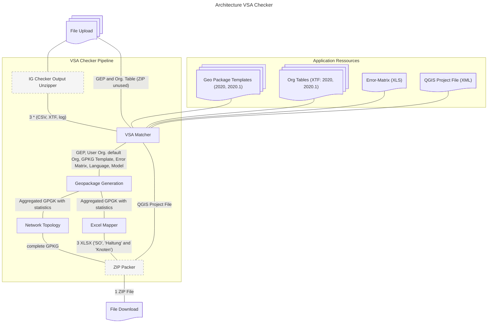

# Architektur VSA Checker

## Zweck

Der VSA Checker validiert und aggregiert Geodaten aus dem Bereich Siedlungsentwässerung (GEP — Genereller Entwässerungsplan). Die Pipeline nimmt hochgeladene Dateien des Benutzers entgegen, gleicht sie gegen mitgelieferte Vorlagen und Referenztabellen ab und liefert ein gebündeltes ZIP-Paket mit aggregiertem GeoPackage, Statistik-Tabellen und QGIS-Projektdatei zurück.

## Übersicht

> Gestrichelte Knoten (`IG Checker Output Unzipper`, `ZIP Packer`) sind Built-In-Prozessoren von geopilot und werden im VSA-Plugin nur konfiguriert, nicht implementiert.

## Application Resources

Statische Ressourcen, die mit der Anwendung ausgeliefert werden und im
gemounteten Docker-Verzeichnis abgelegt sind. Sie werden zur Laufzeit
schreibgeschützt eingelesen.

- **Geo Package Templates (2020, 2020.1)** — Vorlagen-GeoPackages, die als
  Schema-Grundlage für das aggregierte Ausgabe-GPKG dienen. Die Versionsnummern
  entsprechen den VSA-Datenmodellversionen. Die verwendete Version wird anhand der Version des hochgeladenen GEPs bestimmt.
- **Org Tables (XTF: 2020, 2020.1)** — Standard-Organisationstabellen im
  INTERLIS-Transferformat (XTF), eine pro Datenmodellversion. Die verwendete Version wird anhand der Version des hochgeladenen GEPs bestimmt. Die Organisationstabellen enthalten Informationen über die am Projekt beteiligten Organisationen (z.B. Gemeinden, Ingenieurbüros) und werden für die Validierung und Anreicherung der Daten verwendet.
- **Error-Matrix (XLS)** — Excel-Tabelle mit der Definition möglicher
  Validierungsfehler und deren Schweregrad / Kategorisierung. Anhand der Error-Matrix können die Ergebnisse des IG Checkers interpretiert und in die Validierungsergebnisse des VSA Checkers überführt werden. Die Error-Matrix dient als zentrale Referenz für die Fehlerklassifikation und ermöglicht eine konsistente Bewertung der Prüfergebnisse.
- **QGIS Project File (XML)** — Vorbereitetes QGIS-Projekt, das dem Endbenutzer
  ein direkt öffenbares Visualisierungs-Setup für die Ausgabedaten liefert.

## Pipeline-Prozessoren

Die Pipeline ist sequenziell und basiert auf den Abstraktionen aus
`GeoWerkstatt.Geopilot.PipelineCore`. Jeder Prozessor erhält definierte
Eingabe-Daten und produziert wohldefinierte Ausgaben für den nächsten
Schritt.

### IG Checker Output Unzipper

Entpackt das vom Benutzer hochgeladene IG-Checker-Resultat (ZIP) und stellt die enthaltenen Dateien — typischerweise drei Tripel aus CSV, XTF und Log-Datei — für den VSA Matcher bereit. Somit werden 9 Files aus dem ZIP extrahiert: die drei VSA-Prüfklassen `a`, `FP` und `T` <!-- TODO: Bedeutung der Kürzel ergänzen (z.B. a = Anschluss?) -->, jeweils als CSV, XTF und Log. Der Inhalt der verschiedenen Dateitypen ist der selbe aber in unterschiedlichen Formaten (CSV als tabellarische Darstellung, XTF als INTERLIS-Transferformat, Log als Rohtext mit Fehlermeldungen). Die weitere Verarbeitung erfolgt einfachheitshalber mit den CSV-Dateien, da sich diese am besten für die weitere Verarbeitung eignen.

Der Prozess, der welcher Zip Dateien extrahiert und folgenden Prozessen zur Verfügung stellt ist Teil von geopilot und wird daher im VSA Plugin nicht implementiert, sondern nur konfiguriert.

### VSA Matcher

Prozessor, welcher die Eingabedaten aus User-Upload und IG-Checker-Output gemäss ihrer Semantik aufteilt, mit den passenden Application Resources anreichert und auf benannten Kanälen an die nachfolgenden Prozessoren weitergibt.

**Inputs**:

- **User-Upload**: GEP (definiert die Modellversion 2020 / 2020.1 und damit die Auswahl der Resources), optional eine Organisationstabelle.
- **IG Checker Output**: 9 Dateien aus dem Unzipper (`a` / `FP` / `T` × CSV / XTF / Log) — der Matcher verwendet nur die CSV-Dateien für die Weiterverarbeitung.
- **Application Resources**: anhand der Modellversion aus dem GEP wird automatisch das passende Vorlage-GPKG und die passende Standard-Org-Tabelle gewählt; Error-Matrix und QGIS-Projektdatei sind versionsunabhängig.

**Ausgabekanäle** (was an `Geopackage Generation` weitergegeben wird):

- GEP (durchgereicht)
- Modellversion: `2020` oder `2020.1` (extrahiert aus GEP)
- Sprache: `DE` oder `FR` (extrahiert aus GEP) <!-- TODO: Wo wird die Sprache nachgelagert verwendet — Excel-Spaltenüberschriften? Fehlertexte aus der Error-Matrix? Beides? -->
- Optionale Organisationstabelle (durchgereicht, falls vorhanden)
- IG-Checker-CSVs (`a`, `FP`, `T`)
- Vorlage-GPKG (passend zur Modellversion)
- Standard-Org-Tabelle (passend zur Modellversion)
- Error-Matrix
- QGIS-Projektdatei (geht zusätzlich direkt an den `ZIP Packer` — die Aggregation braucht sie nicht)

Der VSA-Matcher enthält eine Liste von Post-Conditions, welche prüfen ob alle notwendigen Daten für die nachfolgenden Schritte vorhanden sind. Wenn eine Post-Condition fehlschlägt, wird der gesamte Prozess mit einem Fehler abgebrochen.

- Exakt ein GEP muss vorhanden sein
- Exakt eine Modellversion muss definiert sein (2020 oder 2020.1)
- Exakt eine Sprache muss definiert sein (DE oder FR)
- Entweder keine oder genau eine Organisationstabelle (optional)
- Drei Error Datensätze aus dem IG Checker Output müssen vorhanden sein (CSV: a, FP und T)
- Ein Geopackage Template muss vorhanden sein
- Eine Standard-Organisationstabelle muss vorhanden sein
- Eine Error-Matrix muss vorhanden sein
- Eine QGIS-Projektdatei muss vorhanden sein

### Geopackage Generation (Aggregation)

Erzeugt aus dem Output des VSA Matcher ein aggregiertes GeoPackage. Dieses GPKG ist Eingabe für zwei nachgelagerte Prozessoren ([Network Topology](#network-topology) und [Excel Mapper](#excel-mapper)) — beide arbeiten auf dem gleichen aggregierten Stand, weil die Excel-Reports keine berechnete Netztopologie benötigen.

Die Aggregation umfasst drei Hauptschritte:

**1. Interlis-Import** — XTF-Dateien werden mit `ili2gpkg` (Tool aus dem INTERLIS-Stack zur Konvertierung XTF → GeoPackage) ins GPKG importiert:

1. Standard-Organisationstabelle importieren
2. Optional (wenn vorhanden) Organisationstabelle aus Upload importieren
3. GEP importieren

**2. Fehleraufbereitung**:

1. Import der Fehler aus dem IG Checker Output (CSV)
2. Error-Matrix-Import (XLS)
3. Verknüpfung der Fehler aus dem IG Checker mit den Definitionen in der Error-Matrix.

**3. Statistiken** — diverse Joins und Aggregationen mit den Geodaten:

1. Fehler kategorisieren und objektweise aggregieren (z.B. Anzahl Fehler je Leitung)
2. Geometrien der betroffenen Objekte mit Fehlern joinen und in eigener Tabelle ablegen (jeder Fehler ist so einzeln darstellbar im GIS)
3. Fehlerstatistik über alle Klassen in eigener Tabelle erstellen

### Network Topology

Komplettiert falls notwendig die Netztopologie und gibt dieses vervollständigte Geopackage als Output weiter. Die Topologie wird anhand der bestehenden Geometrien und der Referenzen in den Daten berechnet. Dabei werden folgende Schritte durchgeführt:

1. Mit Leitungen nicht topologisch verbundene, aber von ihnen referenzierende Netzknoten identifizieren (Start- bzw. Endpunkt Leitung nicht lagegleich mit referenziertem "von-" bzw. "nach-Knoten" mit geringer Toleranz).
2. Ueberlauf_Foerderaggregat: Für jedes Objekt in dieser Tabelle eine Linie zwischen dem "Von-" und dem "nach-"-Knoten erstellen.
3. Bestehende Linien um zusätzlichen Start- bzw. End Node erweitern, der lagegleich mit dem referenzierten Knoten ist
4. Alle Netzkanten inklusive topologisch bereinigten Objekten in neuem Linienlayer speichern
5. Nur topologisch bereinigte Abschnitte als eigene Objekte (Delta zu originalem Layer "leitung") als "Topologielinien" in eigenem Linienlayer ablegen.

### Excel Mapper

Erzeugt aus dem aggregierten GPKG drei XLSX-Tabellen:

- **SO** - Kantonale Erweiterung Solothurn
- **Haltung** - Tabellarische Darstellung der Haltungen (Rohrleitungen).
- **Knoten** - Tabellarische Darstellung der Knoten (Schächte, Sonderbauwerke).

### ZIP Packer

Bündelt das Endergebnis aus drei Quellen zu einem einzigen ZIP-File:

- QGIS-Projektdatei (vom VSA Matcher)
- Vollständiges GPKG (von Network Topology)
- Drei XLSX-Tabellen (vom Excel Mapper)

Dieser Prozess ist Teil von geopilot und wird daher im VSA Plugin nicht implementiert, sondern nur konfiguriert.

Das resultierende ZIP wird dem Benutzer als File Download bereitgestellt.

## Fehlerverhalten

- **VSA Matcher** prüft am Ende eine Liste von Post-Conditions (siehe [VSA Matcher](#vsa-matcher)). Schlägt eine fehl, wird die Pipeline mit einem Fehler abgebrochen — fail-fast vor jeder schwergewichtigen Verarbeitung (Aggregation, Topologie, Excel-Generierung).
- **Geopilot-Built-Ins** (`IG Checker Output Unzipper`, `ZIP Packer`): Fehlerbehandlung erfolgt durch das Geopilot-Framework.
- **Übrige Prozessoren** (`Geopackage Generation`, `Network Topology`, `Excel Mapper`): Prüfung in einer PRE-Condition ob die Daten vorhanden sind, ansonsten Abbruch mit Fehler.
