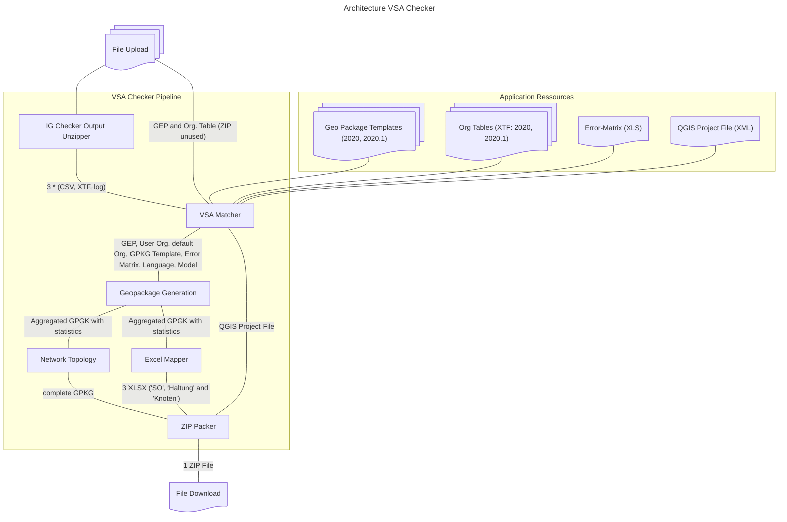

```mermaid
---
title: Architecture VSA Checker
---
flowchart
	subgraph appResources["Application Ressources"]
		geoPackageTemplates@{ shape: "docs", label: "Geo Package Templates (2020, 2020.1)" }
		orgTables@{ shape: "docs", label: "Org Tables (XTF: 2020, 2020.1)" }
		errorMatrix@{ shape: "doc", label: "Error-Matrix (XLS)" }
		qgisProject@{ shape: "doc", label: "QGIS Project File (XML)" }
	end
	subgraph vsaCheckerPipeline["VSA Checker Pipeline"]
		vsaMatcher["VSA Matcher"]
		igCheckerOutputUnzipper["IG Checker Output Unzipper"]
		aggregationProcess["Geopackage Generation"]
		
		networkTopology["Network Topology"]
		excelMapper["Excel Mapper"]
		zipPacker["ZIP Packer"]
	end
	fileUpload@{ shape: "docs", label: "File Upload" }
	fileDownload@{ shape: "doc", label: "File Download" }
	fileUpload --- igCheckerOutputUnzipper
	fileUpload ---|"GEP and Org. Table (ZIP unused)"| vsaMatcher
	geoPackageTemplates --- vsaMatcher
	orgTables --- vsaMatcher
	igCheckerOutputUnzipper ---|"3 * (CSV, XTF, log)"| vsaMatcher
	qgisProject --- vsaMatcher
	errorMatrix --- vsaMatcher
	vsaMatcher ---|"GEP, User Org. default Org, GPKG Template, Error Matrix, Language, Model"| aggregationProcess
	aggregationProcess
	
	aggregationProcess
	networkTopology
	aggregationProcess ---|"Aggregated GPGK with statistics"| networkTopology
	aggregationProcess ---|"Aggregated GPGK with statistics"| excelMapper
	vsaMatcher ---|"QGIS Project File"| zipPacker
	networkTopology ---|"complete GPKG"| zipPacker
	excelMapper ---|"3 XLSX ('SO', 'Haltung' and 'Knoten')"| zipPacker
	zipPacker --- |"1 ZIP File"| fileDownload
```
